# Architecture

kit-censura follows a simple three-phase pipeline, run periodically via cron:

```
censorship-get  →  [update + parse each list]  →  build DNS config
censorship-apply  →  upload DNS config  →  install IP routes
```

## Component diagram

```mermaid
flowchart TD

    %% ── Cron entry points ──────────────────────────────────────────
    subgraph cron["Cron entry points"]
        CC["censorship-cron\n(every 6 h)"]
        CCP["censorship-cron-pscaiip\n(every 5 min)"]
    end

    %% ── Orchestration ──────────────────────────────────────────────
    CC --> CG["censorship-get"]
    CC --> CS["censorship-summary"]
    CC --> CA["censorship-apply"]
    CCP --> CG
    CCP --> CS
    CCP --> CA

    CG --> |"for each list in UPDATE_LISTS"| UPD

    %% ── Update scripts ─────────────────────────────────────────────
    subgraph UPD["update_* (one per list)"]
        direction LR
        U1["update_aams"]
        U2["update_tabacchi"]
        U3["update_consob"]
        U4["update_ivass"]
        U5["update_manuale"]
        U6["update_agcom"]
        U7["update_cncpo"]
        U8["update_pscaiip"]
    end

    %% ── Download helpers ────────────────────────────────────────────
    U1 --> DA["download_aams.py\n(HTTP scraping)"]
    U2 --> DT["download_tabacchi.py\n(HTTP scraping)"]
    U3 --> DC["download_consob.py\n(HTTP scraping)"]
    U4 --> DI["download_ivass.py\n(HTTP + PDF)"]
    U6 --> |"method: website"| DAG["download_agcom.py\n(HTTP scraping)"]
    U6 --> |"method: pec"| DPEC_AG["agcom-dda/\ndownload_attachment.py\n(IMAP PEC)"]
    U7 --> DPEC_CN["cncpo/\ndownload_attachment.py\n(IMAP PEC + GPG decrypt)"]
    U8 --> PS["Piracy Shield\nClient AIIP\n(Docker)"]

    %% ── PEC reply senders ───────────────────────────────────────────
    DPEC_AG --> |"auto-reply"| ES_AG["agcom-dda/\nemail_sender.py"]
    DPEC_CN --> |"auto-reply"| ES_CN["cncpo/\nemail_sender.py"]

    %% ── Parsers ─────────────────────────────────────────────────────
    U1 & U2 & U3 & U4 & U5 & U6 --> PA["parse_aams\n(Perl — plain text)"]
    U7 --> PC["parse_cncpo\n(Perl — CSV)"]

    %% ── Intermediate list files ─────────────────────────────────────
    PA & PC & U8 --> LF[("lists/\n<name>       ← FQDNs\n<name>-ip    ← IPs")]

    %% ── DNS config generation ───────────────────────────────────────
    CG --> BBC["build-bind-config\n→ lists/named.conf"]
    CG --> BUC["build-unbound-config\n→ lists/unbound.conf"]

    %% ── Apply phase ─────────────────────────────────────────────────
    CA --> UBC["upload-bind-config\n(rsync + rndc reconfig)"]
    CA --> UUC["upload-unbound-config\n(rsync + unbound reload)"]
    CA --> IRL["install-routes-linux\n(ip route add/del)"]

    LF --> BBC & BUC
    LF --> |"IP lists"| SP["supernets.py\n(CIDR aggregation)"]
    SP --> IRL

    %% ── Remote targets ───────────────────────────────────────────────
    UBC --> DNS["Name servers\n(BIND)"]
    UUC --> DNS2["Name servers\n(Unbound)"]
    IRL --> RT["Border router\n/ BGP daemon"]

    %% ── Zone files ───────────────────────────────────────────────────
    UBC --> |"db.* zone files"| DNS

    %% ── Styling ──────────────────────────────────────────────────────
    classDef entry   fill:#e8f4f8,stroke:#2980b9,color:#1a1a1a
    classDef orch    fill:#eafaf1,stroke:#27ae60,color:#1a1a1a
    classDef update  fill:#fef9e7,stroke:#f39c12,color:#1a1a1a
    classDef helper  fill:#fdf2f8,stroke:#8e44ad,color:#1a1a1a
    classDef parser  fill:#fdedec,stroke:#e74c3c,color:#1a1a1a
    classDef infra   fill:#f2f3f4,stroke:#7f8c8d,color:#1a1a1a
    classDef storage fill:#eaf2ff,stroke:#2471a3,color:#1a1a1a
    classDef remote  fill:#f9f9f9,stroke:#555,stroke-dasharray:5 5,color:#1a1a1a

    class CC,CCP entry
    class CG,CS,CA orch
    class U1,U2,U3,U4,U5,U6,U7,U8 update
    class DA,DT,DC,DI,DAG,DPEC_AG,DPEC_CN,ES_AG,ES_CN,PS helper
    class PA,PC parser
    class BBC,BUC,UBC,UUC,IRL,SP infra
    class LF storage
    class DNS,DNS2,RT remote
```



## Data flow per list type

### HTTP-scraped lists (aams, tabacchi, consob, ivass, agcom/website)

```
download_*.py → lista.<name> → parse_aams → lists/<name>.new → lists/<name>
```

### PEC lists (cncpo, agcom/pec)

```
IMAP inbox → download_attachment.py → [GPG decrypt] → lista.<name>
           → parse_cncpo / parse_aams → lists/<name>.new → lists/<name>
           → email_sender.py (auto-reply receipt)
```

### Piracy Shield (pscaiip)

```
Docker (psc:run + psc:process-queue) → last.txt (fqdn/ipv4/ipv6)
                                     → lista.pscaiip / lista.pscaiip-ip
                                     → lists/pscaiip.new / lists/pscaiip-ip
```

### Manual list (manuale)

```
lista.manuale (hand-edited) → parse_aams → lists/manuale.new → lists/manuale
```

## Key directories and files at runtime

```
kit-censura/
├── config.sh               All configuration parameters
├── lista.*                 Source list files (one per authority)
├── lists/
│   ├── <name>              Parsed FQDN list (one domain per line)
│   ├── <name>-ip           Parsed IP list (one address/CIDR per line)
│   ├── named.conf          BIND configuration fragment (generated)
│   ├── unbound.conf        Unbound configuration fragment (generated)
│   ├── ip-fullist          Merged IP list across all active lists
│   └── cidr-fullist        Aggregated CIDR list (when AGGREGATE_PREFIX=true)
├── cncpo/
│   ├── download/           Temporary storage for PEC attachments
│   ├── gpg/                GPG key storage
│   └── settings.yaml       Generated at runtime from settings.yaml.template
├── agcom-dda/
│   ├── download/           Temporary storage for PEC attachments
│   └── settings.yaml       Generated at runtime from settings.yaml.template
├── db.*                    BIND zone files (static, one per list)
└── tmp/                    Temporary working files
```
